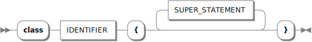
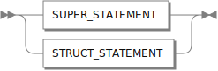
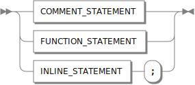
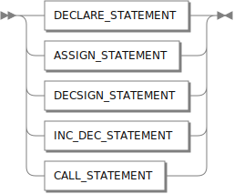
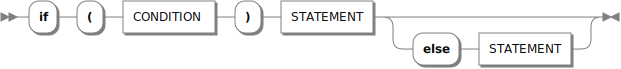
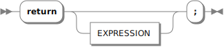
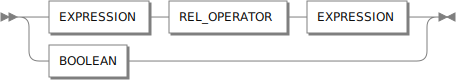
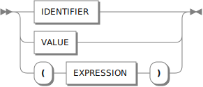
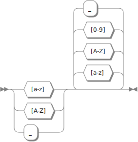
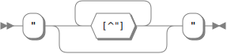

# aParser

The project is a compiler that takes a source program written in **C# (input)** then translates it into a target program written in **Visual Basic (output)**. This process is done by going through three modules (`Tokenizer`, `Parser`, and `Translator`) respectively. Each module will be explained separately in this report.

## Tokenizer

### What is the Tokenizer?

Tokenizer / Lexical Analyzer is a program that takes a sequence of characters (input) and output a sequence of tokens (output).

### Tokens Definitions

The tokenizer has a list of definitions for each possible token it may produce by grouping a sequence of characters. Each token definition consists of:

- **Type**: used to distinguish between tokens
- **Regular Expression (RegEx)**: used to capture (match) the values

The following tables represent all the definitions used in the project, with an example of matched value(s) for each one.

#### Keywords

| **Type**    | **Regular Expression**                                                                                                     | **Matched Value(s)**                         |
| :---------- | :------------------------------------------------------------------------------------------------------------------------- | :------------------------------------------- |
| **Using**   | using                                                                                                                      | `using`                                      |
| **Class**   | class                                                                                                                      | `class`                                      |
| **If**      | if                                                                                                                         | `if`                                         |
| **Else**    | else                                                                                                                       | `else`                                       |
| **For**     | for                                                                                                                        | `for`                                        |
| **Do**      | do                                                                                                                         | `do`                                         |
| **While**   | while                                                                                                                      | `while`                                      |
| **Switch**  | switch                                                                                                                     | `switch`                                     |
| **Case**    | case                                                                                                                       | `case`                                       |
| **Break**   | break                                                                                                                      | `break`                                      |
| **Default** | default                                                                                                                    | `default`                                    |
| **Return**  | return                                                                                                                     | `return`                                     |
| **Null**    | null                                                                                                                       | `null`                                       |
| **True**    | true                                                                                                                       | `true`                                       |
| **False**   | false                                                                                                                      | `false`                                      |
| **False**   | (void \| var) \| (bool \| char \| short \| int \| long \| float \| double \| decimal \| string \| String) (\\[\\] \| \\?)? | `void` <br> `bool` <br> `char?` <br> `int[]` |

#### Values

| **Type**             | **Regular Expression**                            | **Matched Value(s)**                          |
| :------------------- | :------------------------------------------------ | :-------------------------------------------- |
| **Number**           | \d\*\\.\d+ \| \d+                                 | `77` <br> `.25` <br> `3.14`                   |
| **String**           | "[^"]\*"                                          | `"This is string"`                            |
| **Identifier**       | [a-zA-Z_]\w\*                                     | `fact` <br> `_private` <br> `iD_1`            |
| **Comment**          | (?<=//) .\*? (?=(\r \| \n \| //))                 | // `inline comment`                           |
| **MultilineComment** | (?<=/\\\*) (?:(?!\\\*/)(?:.\|[\r\n]))\* (?=\\\*/) | /\* <br> `multi line` <br> `comment` <br> \*/ |

#### Operators

| **Type**               | **Regular Expression** | **Matched Value(s)** |
| :--------------------- | :--------------------- | :------------------- |
| **And**                | && \| &                | `&&` <br> `&`        |
| **Or**                 | \\\|\\\| \| \\\|       | `\|\|` <br> `\|`     |
| **Not**                | !                      | `!`                  |
| **Equal**              | =                      | `=`                  |
| **PlusEqual**          | \\+=                   | `+=`                 |
| **MinusEqual**         | -=                     | `-=`                 |
| **DoubleEquals**       | ==                     | `==`                 |
| **NotEqual**           | !=                     | `!=`                 |
| **LessThan**           | <                      | `<`                  |
| **GreaterThan**        | >                      | `>`                  |
| **LessThanOrEqual**    | <=                     | `<=`                 |
| **GreaterThanOrEqual** | >=                     | `>=`                 |

#### Symbols

| **Type**                 | **Regular Expression** | **Matched Value(s)** |
| :----------------------- | :--------------------- | :------------------- |
| **OpenRoundBracket**     | \\(                    | `(`                  |
| **CloseRoundBracket**    | \\)                    | `)`                  |
| **OpenCurlyBracket**     | {                      | `{`                  |
| **CloseCurlyBracket**    | }                      | `}`                  |
| **OpenSquareBracket**    | \\[                    | `[`                  |
| **CloseSquareBracket**   | \\]                    | `]`                  |
| **Plus**                 | \\+                    | `+`                  |
| **Minus**                | -                      | `-`                  |
| **DoublePluses**         | \\+\\+                 | `++`                 |
| **DoubleMinuses**        | --                     | `--`                 |
| **Percent**              | %                      | `%`                  |
| **Asterisk**             | \\\*                   | `\*`                 |
| **BackSlash**            | \\\                    | `\`                  |
| **ForwardSlash**         | /                      | `/`                  |
| **DoubleForwardSlashes** | //                     | `//`                 |
| **ForwardSlashAsterisk** | /\\\*                  | `/*`                 |
| **AsteriskForwardSlash** | \\\*/                  | `*/`                 |
| **Dot**                  | \\.                    | `.`                  |
| **Comma**                | ,                      | `,`                  |
| **Colon**                | :                      | `:`                  |
| **Semicolon**            | ;                      | `;`                  |

### Implementation

All these token types are grouped as **enum** in the [TokenType.cs](./Tokenizer/Models/TokenType.cs) file.

```C#
public enum TokenType
{
    // Keywords
    Using,               // using
    Class,               // class
    If,                  // if
    Else,                // else
    For,                 // for
    Do,                  // do
    While,               // while
    Switch,              // switch
    Case,                // case
    Break,               // break
    Default,             // default
    Return,              // return
    Null,                // null
    True,                // true
    False,               // false
    DataType,            // void | bool | char? | int[]

    // Values
    Number,              // 77 | .25 | 3.14
    String,              // "I am 'Moaz'"
    Comment,             // Any Character After (//) and Before (\r | \n | //)
    Identifier,          // fact | _private | iD_1
    MultilineComment,    // Any Character After (/*) and Before (*/)

    // Operators
    And,                 // && | &
    Or,                  // || | |
    Not,                 // !
    Equal,               // =
    PlusEqual,           // +=
    MinusEqual,          // -=
    DoubleEquals,        // ==
    NotEqual,            // !=
    LessThan,            // <
    GreaterThan,         // >
    LessThanOrEqual,     // <=
    GreaterThanOrEqual,  // >=

    // Symbols
    OpenRoundBracket,    // (
    CloseRoundBracket,   // )
    OpenCurlyBracket,    // {
    CloseCurlyBracket,   // }
    OpenSquareBracket,   // [
    CloseSquareBracket,  // ]
    Plus,                // +
    Minus,               // -
    DoublePluses,        // ++
    DoubleMinuses,       // --
    Percent,             // %
    Asterisk,            // *
    BackSlash,           // \
    ForwardSlash,        // /
    DoubleForwardSlashes,// //
    ForwardSlashAsterisk,// /*
    AsteriskForwardSlash,// */
    Dot,                 // .
    Comma,               // ,
    Colon,               // :
    Semicolon            // ;
}
```

and their definitions are created and stored at **List\<TokenDefinition\>** in the [Tokenizer.cs](./Tokenizer/Tokenizer.cs) file.

```C#
private readonly List<TokenDefinition> _tokenDefinitions = new List<TokenDefinition>
{
    // Keywords
    new TokenDefinition(TokenType.Using, @"using"),
    new TokenDefinition(TokenType.Class, @"class"),
    new TokenDefinition(TokenType.If, @"if"),
    new TokenDefinition(TokenType.Else, @"else"),
    new TokenDefinition(TokenType.For, @"for"),
    new TokenDefinition(TokenType.Do, @"do", 1),
    new TokenDefinition(TokenType.While, @"while"),
    new TokenDefinition(TokenType.Switch, @"switch"),
    new TokenDefinition(TokenType.Case, @"case"),
    new TokenDefinition(TokenType.Default, @"default"),
    new TokenDefinition(TokenType.Break, @"break"),
    new TokenDefinition(TokenType.Return, @"return"),
    new TokenDefinition(TokenType.Null, @"null"),
    new TokenDefinition(TokenType.True, @"true"),
    new TokenDefinition(TokenType.False, @"false"),
    new TokenDefinition(TokenType.DataType, @"(void|var)|(bool|char|short|int|long|float|double|decimal|String|string)(\[\]|\?)?"),

    // Values
    new TokenDefinition(TokenType.Number, @"\d*\.\d+|\d+"),
    new TokenDefinition(TokenType.String, @"""[^""]*"""),
    new TokenDefinition(TokenType.Identifier, @"[a-zA-Z_]\w*", 1),
    new TokenDefinition(TokenType.Comment, @"(?<=//).*?(?=(\r|\n|//))"),
    new TokenDefinition(TokenType.MultilineComment, @"(?<=/\*)(?:(?!\*/)(?:.|[\r\n]))*(?=\*/)"),

    // Operators
    new TokenDefinition(TokenType.And, @"&&|&"),
    new TokenDefinition(TokenType.Or, @"\|\||\|"),
    new TokenDefinition(TokenType.Not, @"!", 1),
    new TokenDefinition(TokenType.Equal, @"=", 1),
    new TokenDefinition(TokenType.PlusEqual, @"\+="),
    new TokenDefinition(TokenType.MinusEqual, @"-="),
    new TokenDefinition(TokenType.DoubleEquals, @"=="),
    new TokenDefinition(TokenType.NotEqual, @"!="),
    new TokenDefinition(TokenType.LessThan, @"<", 1),
    new TokenDefinition(TokenType.GreaterThan, @">", 1),
    new TokenDefinition(TokenType.LessThanOrEqual, @"<="),
    new TokenDefinition(TokenType.GreaterThanOrEqual, @">="),

    // Symbols
    new TokenDefinition(TokenType.OpenRoundBracket, @"\("),
    new TokenDefinition(TokenType.CloseRoundBracket, @"\)"),
    new TokenDefinition(TokenType.OpenCurlyBracket, @"{"),
    new TokenDefinition(TokenType.CloseCurlyBracket, @"}"),
    new TokenDefinition(TokenType.OpenSquareBracket, @"\["),
    new TokenDefinition(TokenType.CloseSquareBracket, @"\]"),
    new TokenDefinition(TokenType.Plus, @"\+", 1),
    new TokenDefinition(TokenType.Minus, @"-", 1),
    new TokenDefinition(TokenType.DoublePluses, @"\+\+"),
    new TokenDefinition(TokenType.DoubleMinuses, @"--"),
    new TokenDefinition(TokenType.Percent, @"%"),
    new TokenDefinition(TokenType.Asterisk, @"\*", 1),
    new TokenDefinition(TokenType.BackSlash, @"\\"),
    new TokenDefinition(TokenType.ForwardSlash, @"/", 1),
    new TokenDefinition(TokenType.DoubleForwardSlashes, @"//"),
    new TokenDefinition(TokenType.ForwardSlashAsterisk, @"/\*"),
    new TokenDefinition(TokenType.AsteriskForwardSlash, @"\*/"),
    new TokenDefinition(TokenType.Dot, @"\."),
    new TokenDefinition(TokenType.Comma, @","),
    new TokenDefinition(TokenType.Colon, @":"),
    new TokenDefinition(TokenType.Semicolon, @";"),
};
...
```

#### Fixed Problems

#### 1. When Token Overlap

When tokenizer face some sequence of character like `++` it become confused, is it _one token_ of type **DoublePluses**? Or _two sequential tokens_ of type **Plus**? This problem also applies to other overlapping tokens like: {`+`, `+=`} & {`-`, `--`} & {`-`, `-=`} & {`/`, `//`}

_Solution:_

Each token will be assigned a **Priority** property with default value **0** _(Highest Priority)_, and when two tokens overlap like `+` and `+=` we decrease the priority of the token with shorter length `+` to be **1**.  
Now, the tokenizer won't get confused between `+` and `+=` anymore, and will take the one with higher priority `+=`.

#### 2. Token Inside Token

When tokenizer face some sequence of character like `"String + String = String"` it will produce _three types_ of tokens which are:

- **String**: `"String + String = String"`
- **Plus**: `+`
- **Equal**: `=`

but we only need the token with type **String**!!

_Solution:_

Each token will be assigned a **Start Index** and **End Index** properties, so that previous tokens will have:

| **Type** | **Value**                    | **Start Index** | **End Index** |
| :------- | :--------------------------- | :-------------: | :-----------: |
| String   | `"String + String = String"` |        0        |      25       |
| Plus     | `+`                          |        8        |       9       |
| Equal    | `=`                          |       17        |      18       |

and we ignore any token starts within the range of another one.

Now, the tokenizer will produce only one token which is with type **String** and ignore the inside ones.

## Parser

### What is the Parser?

Parser / Syntax Analyzer is a program that takes a sequence of tokens - generated form the Tokenizer - and groups them to form structures specified by the productions of context free grammar (CFG) being used.

### Parser Roles

- Recognize Context Free Syntax
- Produce Meaningful Error Messages
- Construct Intermediate Representation (IR)

### Context Free Grammar (CFG)

Summary:

- `CAPITAL_CASE` : Non-Terminal
- `small_case` : Terminal
- `|` : Alternates (Or)
- `ε` : Empty

```plaintext
  PROGRAM --> IMPORTS CLASSES

  IMPORTS          --> IMPORT_STATEMENT IMPORTS | ε
  IMPORT_STATEMENT --> using IDS;

  CLASSES          --> CLASS_STATEMENT CLASSES | ε
  CLASS_STATEMENT  --> class id { SUPER_STATEMENTS }
```

```plaintext
  SUPER_STATEMENTS --> SUPER_STATEMENT SUPER_STATEMENTS | ε
  SUPER_STATEMENT  --> COMMENT_STATEMENT | FUNCTION_STATEMENT | INLINE_STATEMENT ;
```

```plaintext
  COMMENT_STATEMENT  --> // comment | /* multiline_comment */
  FUNCTION_STATEMENT --> data_type id (DECLARES) { STATEMENTS }
  INLINE_STATEMENT     --> DECSIGN_STATEMENT | DECLARE_STATEMENT | INC_DEC_STATEMENT | ASSIGN_STATEMENT | CALL_STATEMENT
    DECSIGN_STATEMENT  --> data_type id = EXPRESSION
    DECLARE_STATEMENT  --> data_type id
    INC_DEC_STATEMENT  --> id INC_DEC_OPERATOR
    ASSIGN_STATEMENT   --> id ASSIGN_OPERATOR EXPRESSION
    CALL_STATEMENT     --> IDS(EXPRESSIONS)
```

```plaintext
  STATEMENTS --> STATEMENT STATEMENTS | ε
  STATEMENT  --> SUPER_STATEMENT | STRUCT_STATEMENT
```

```plaintext
  STRUCT_STATEMENT --> IF_STATEMENT | WHILE_STATEMENT | DO_WHILE_STATEMENT | FOR_STATEMENT | BLOCK_STATEMENT | RETURN_STATEMENT | SWITCH_STATEMENT
    IF_STATEMENT          --> if (CONDITION) STATEMENT ELSE_STATEMENT
    ELSE_STATEMENT        --> else STATEMENT  | ε
    WHILE_STATEMENT       --> while (CONDITION) STATEMENT
    DO_WHILE_STATEMENT    --> do STATEMENT while (CONDITION);
    FOR_STATEMENT         --> for (INLINE_STATEMENT; CONDITION; INLINE_STATEMENT) STATEMENT
    BLOCK_STATEMENT       --> { STATEMENTS }
    RETURN_STATEMENT      --> return RETURN_STATEMENT_REST;
    RETURN_STATEMENT_REST --> EXPRESSION | ε
    SWITCH_STATEMENT      --> switch (EXPRESSION) { CASES }
    CASES                 --> CASE CASES | ε
    CASE                  --> CASE_STATEMENT | DEFAULT_STATEMENT
    CASE_STATEMENT        --> case VALUE: STATEMENT break;
    DEFAULT_STATEMENT     --> default: STATEMENT break;
```

```plaintext
  CONDITION  --> EXPRESSION REL_OPERATOR EXPRESSION | true | false
  EXPRESSION --> VALUE | id | ( EXPRESSION )
  VALUE      --> string | number | true | false | null
```

```plaintext
  IDS              --> id MORE_IDS
  MORE_IDS         --> .IDS | ε

  DECLARES         --> DECLARE_STATEMENT MORE_DECLARES | ε
  MORE_DECLARES    --> , DECLARES | ε

  EXPRESSIONS      --> EXPRESSION MORE_EXPRESSIONS | ε
  MORE_EXPRESSIONS --> , EXPRESSIONS | ε
```

```plaintext
  INC_DEC_OPERATOR --> ++ | --
  ASSIGN_OPERATOR  --> = | += | -=
  REL_OPERATOR     --> == | != | > |  >= | < | <=
```

### BNF Syntax Diagram

> In computer science, Backus–Naur form (BNF or Backus normal form) is a notation used to describe the syntax of programming languages or other formal languages. It was developed by John Backus and Peter Naur. BNF can be described as a metasyntax notation for context-free grammars.
>
> -- _[Backus–Naur form @ Wikipedia](https://en.wikipedia.org/w/index.php?title=Backus-Naur_form&oldid=1204483713)_

#### PROGRAM


#### IMPORT_STATEMENT


referenced by:

- [PROGRAM](#program)

#### CLASS_STATEMENT



referenced by:

- [PROGRAM](#program)

#### STATEMENT



referenced by:

- [BLOCK_STATEMENT](#block_statement)
- [CASE_STATEMENT](#case_statement)
- [DEFAULT_STATEMENT](#default_statement)
- [DO_WHILE_STATEMENT](#do_while_statement)
- [FOR_STATEMENT](#for_statement)
- [FUNCTION_STATEMENT](#function_statement)
- [IF_STATEMENT](#if_statement)
- [WHILE_STATEMENT](#while_statement)

#### SUPER_STATEMENT



referenced by:

- [CLASS_STATEMENT](#class_statement)
- [STATEMENT](#statement)

#### COMMENT_STATEMENT


referenced by:

- [SUPER_STATEMENT](#super_statement)

#### COMMENT


referenced by:

- [COMMENT_STATEMENT](#comment_statement)

#### MULTILINE_COMMENT


referenced by:

- [COMMENT_STATEMENT](#comment_statement)

#### FUNCTION_STATEMENT


referenced by:

- [SUPER_STATEMENT](#super_statement)

#### INLINE_STATEMENT



referenced by:

- [FOR_STATEMENT](#for_statement)
- [SUPER_STATEMENT](#super_statement)

#### DECLARE_STATEMENT


referenced by:

- [FUNCTION_STATEMENT](#function_statement)
- [INLINE_STATEMENT](#inline_statement)

#### ASSIGN_STATEMENT


referenced by:

- [INLINE_STATEMENT](#inline_statement)

#### DECSIGN_STATEMENT


referenced by:

- [INLINE_STATEMENT](#inline_statement)

#### INC_DEC_STATEMENT


referenced by:

- [INLINE_STATEMENT](#inline_statement)

#### CALL_STATEMENT


referenced by:

- [INLINE_STATEMENT](#inline_statement)

#### STRUCT_STATEMENT


referenced by:

- [STATEMENT](#statement)

#### BLOCK_STATEMENT


referenced by:

- [STRUCT_STATEMENT](#struct_statement)

#### IF_STATEMENT



referenced by:

- [STRUCT_STATEMENT](#struct_statement)

#### WHILE_STATEMENT


referenced by:

- [STRUCT_STATEMENT](#struct_statement)

#### DO_WHILE_STATEMENT


referenced by:

- [STRUCT_STATEMENT](#struct_statement)

#### FOR_STATEMENT


referenced by:

- [STRUCT_STATEMENT](#struct_statement)

#### RETURN_STATEMENT



referenced by:

- [STRUCT_STATEMENT](#struct_statement)

#### SWITCH_STATEMENT


referenced by:

- [STRUCT_STATEMENT](#struct_statement)

#### CASE_STATEMENT


referenced by:

- [SWITCH_STATEMENT](#switch_statement)

#### DEFAULT_STATEMENT


referenced by:

- [SWITCH_STATEMENT](#switch_statement)

#### CONDITION



referenced by:

- [DO_WHILE_STATEMENT](#do_while_statement)
- [FOR_STATEMENT](#for_statement)
- [IF_STATEMENT](#if_statement)
- [WHILE_STATEMENT](#while_statement)

#### EXPRESSION



referenced by:

- [ASSIGN_STATEMENT](#assign_statement)
- [CONDITION](#condition)
- [DECSIGN_STATEMENT](#decsign_statement)
- [EXPRESSION](#expression)
- [RETURN_STATEMENT](#return_statement)
- [SWITCH_STATEMENT](#switch_statement)

#### IDENTIFIER



referenced by:

- [ASSIGN_STATEMENT](#assign_statement)
- [CALL_STATEMENT](#call_statement)
- [CLASS_STATEMENT](#class_statement)
- [DECLARE_STATEMENT](#declare_statement)
- [DECSIGN_STATEMENT](#decsign_statement)
- [EXPRESSION](#expression)
- [FUNCTION_STATEMENT](#function_statement)
- [IMPORT_STATEMENT](#import_statement)
- [INC_DEC_STATEMENT](#inc_dec_statement)

#### VALUE


referenced by:

- [CASE_STATEMENT](#case_statement)
- [EXPRESSION](#expression)

#### NUMBER


referenced by:

- [VALUE](#value)

#### BOOLEAN


referenced by:

- [CONDITION](#condition)
- [VALUE](#value)

#### STRING



referenced by:

- [VALUE](#value)

#### INC_DEC_OPERATOR


referenced by:

- [INC_DEC_STATEMENT](#inc_dec_statement)

#### ASSIGN_OPERATOR


referenced by:

- [ASSIGN_STATEMENT](#assign_statement)

#### REL_OPERATOR


referenced by:

- [CONDITION](#condition)

#### DATA_TYPE


referenced by:

- [DECLARE_STATEMENT](#declare_statement)
- [DECSIGN_STATEMENT](#decsign_statement)
- [FUNCTION_STATEMENT](#function_statement)
